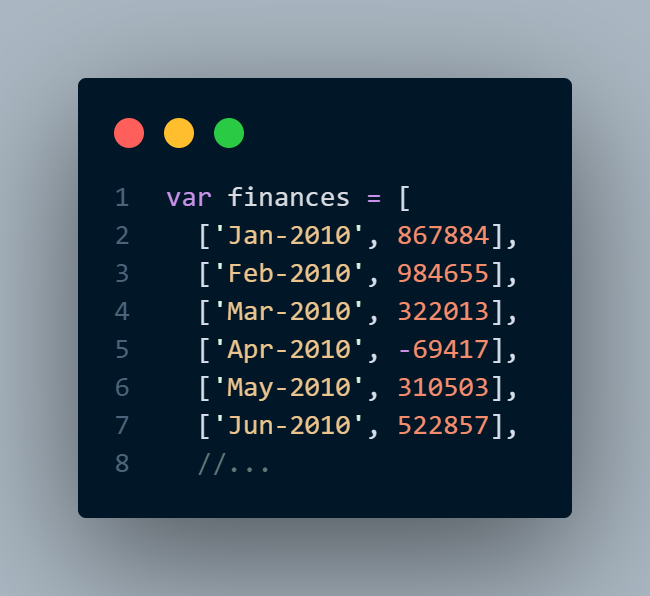
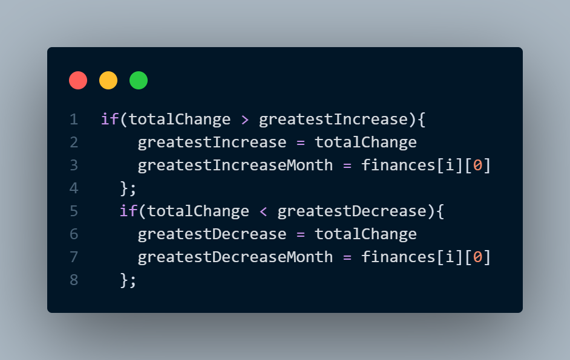
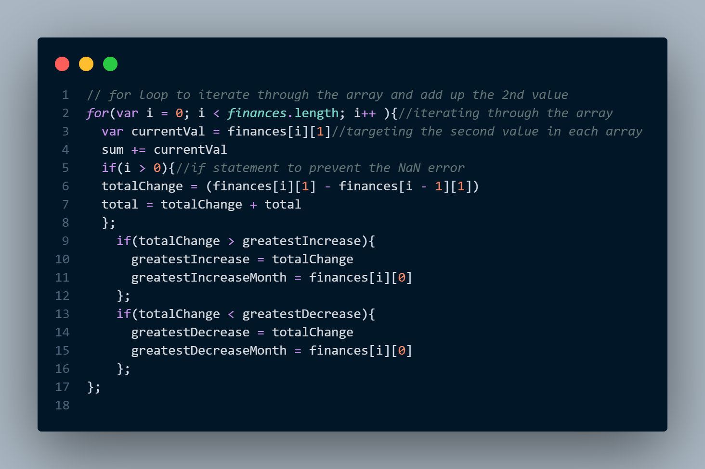
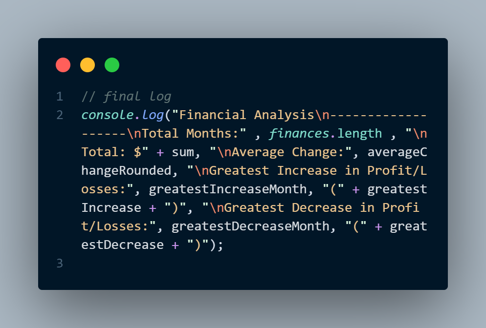

# Console Finance

Live deployed link - https://greenie115.github.io/Console-Finances/

The aim of this project was to display some financial analytics based on a data set. This is to simulate the types of smaller dynamic reports needed for a company using JAvaScript. 

## Installation

There is no installation required for this project. 

## Usage

The data set is on lines 1-88

Here are the empty variables that are used through the loop. lines 91-98

The loop targets the second value in each array item. 

 We then use this targeted value to find the biggest increase and decrease in profit and losses. 

Finally, we log all of the values in a single `console.loy()` 

Just open the Developer Console on the HTML page to see the results. You can do this by right-clicking on the page and selecting "inspect" or press `Ctrl + Shift + i`

## Contributing

Pull requests are welcome. For major changes, please open an issue first
to discuss what you would like to change.

Please make sure to update tests as appropriate.

## License

[MIT](https://choosealicense.com/licenses/mit/)